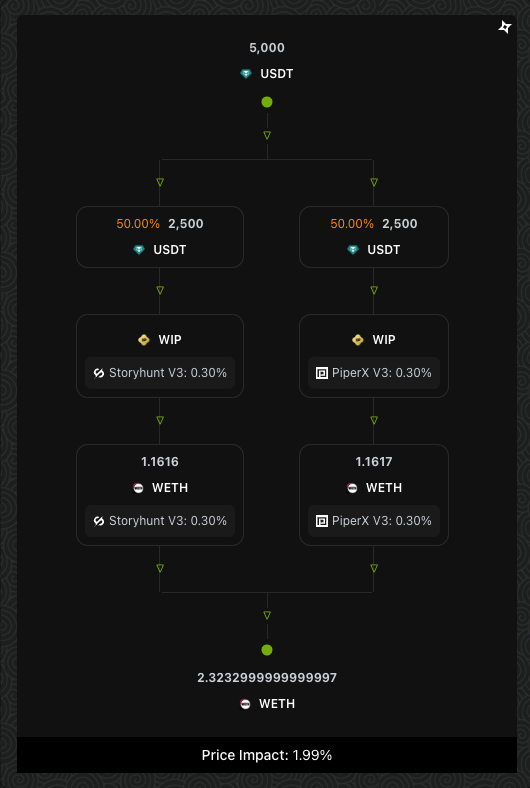

# Dynamic Trade Routing

<figure><figcaption>
Sourcing superior routes for your trade
</figcaption></figure>

Mimboku Aggregator has Dynamic Trade Routing, which aggregates fractured liquidity across DEXs thereby enabling users to source more capitally efficient liquidity to support their trades. Through integration with a myriad of DEX smart contracts, Mimboku Aggregator is able to function as an optimisation layer between the DEXes smart contract and incoming trade requests. This ensures that users always get more optimal rates for any token swap, on any of the Mimboku Aggregator supported networks.

Mimboku trades are split and routed through different DEXs for the best prices within the same chain/network. Users can trade tokens that may not be in Mimboku pools but are available on other DEXs. You can see exactly which DEXs were involved in the trade and the % split between them.

