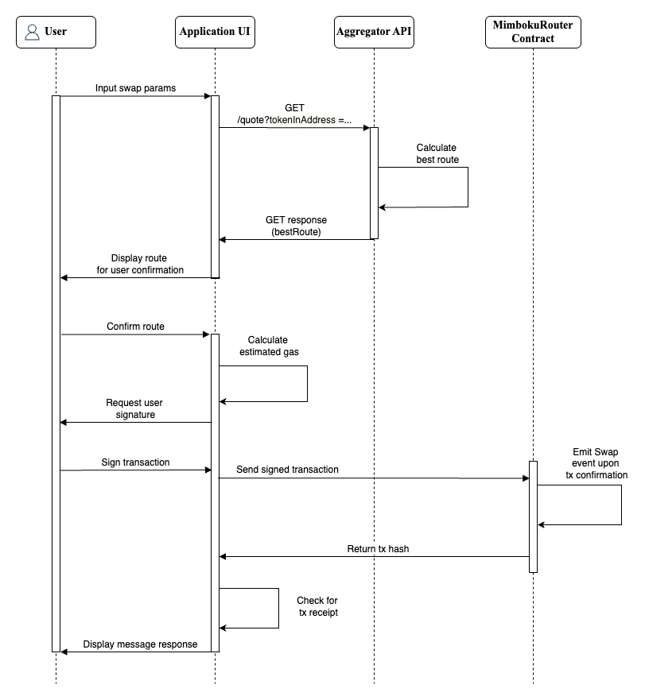

# Execute A Swap With The Aggregator API

## Overview

MimbokuSwap maintains a single API specification for chains:

- [Swap API specs for chains](../aggregator-api/swaps.md)


**MimbokuSwap Aggregator API**

Following feedback on the initial non-versioned API, MimbokuSwap has implemented a more performant `[V1]` API which improves the response time for getting a route via offloading encoding requirements to the post method.

## Sequence diagram

<figure><figcaption>
API sequence diagram
</figcaption></figure>

To execute a swap, the router (`MimbokuRouter`) contract requires the encoded swap data to be included as part of the transaction. This encoded swap data as well as other swap metadata are returned as part of the API response. As such, developers are expected to call the swap API prior to sending a transaction to the router contract.
