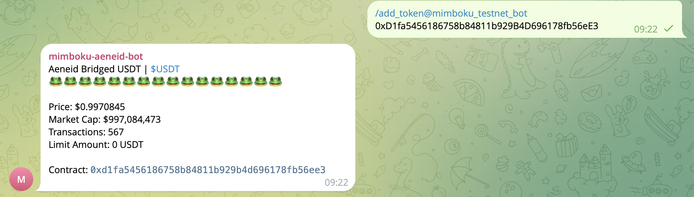
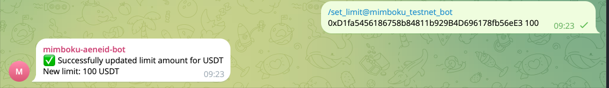
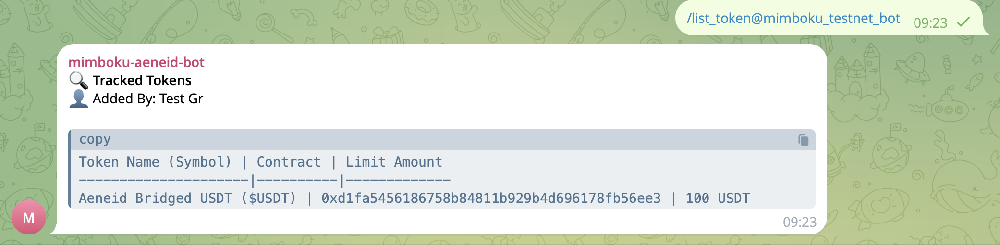
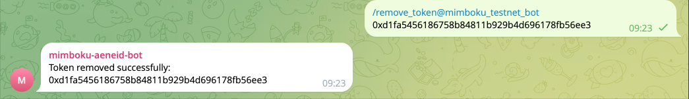
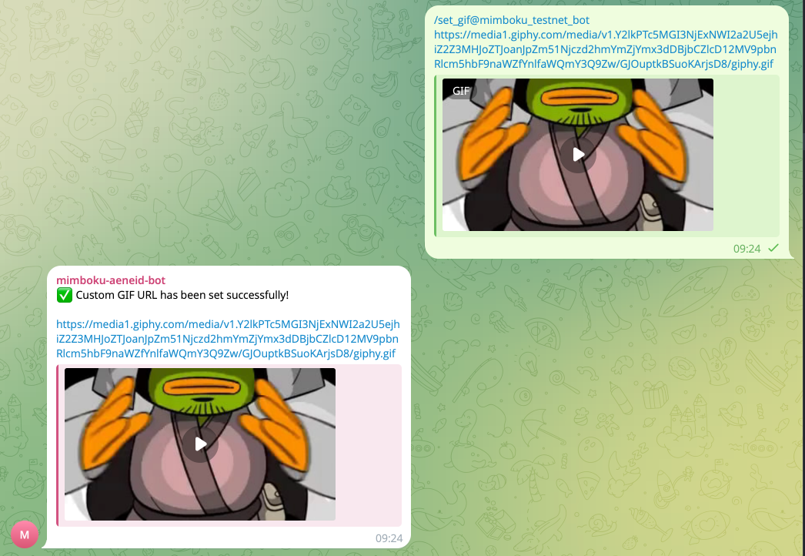
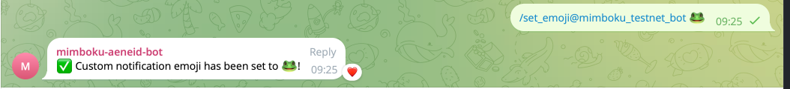
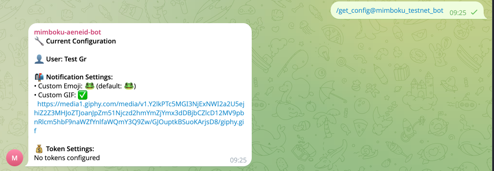

# Mimboku Bot

## Introduction

[Mimboku Telegram Bot](https://t.me/MimbokuBot)

Mimboku Buy Bot is a versatile Telegram bot that can operate in both direct messages and group chats. Users can interact with the bot in two ways:

1. **Direct Messages**

   - Start a private chat with the bot
   - Use all available commands directly
   - Manage your personal notification settings and token tracking

2. **Group Chat Mode**
   - Add the bot to any Telegram group
   - Only group administrators can use configuration commands like:
     - `/set_limit` - Set notification thresholds for tokens
     - `/set_emoji` - Customize notification emojis
     - `/set_gif` - Set custom GIF for notifications
     - `/get_config` - View current notification settings and token configurations
   - All group members will receive notifications based on admin settings

This dual-mode functionality makes the bot flexible for both individual use and team/community monitoring scenarios.

## Bot Commands

The bot supports the following commands:

### Token Management Commands

1. **Add Token** - Add a new token to track

   ```
   /add_token <token_address> [limit_amount]
   ```

   Example:

   ```
   /add_token 0x1234567890123456789012345678901234567890 100
   ```

   - `token_address`: The contract address of the token (42 characters, starts with 0x)
   - `limit_amount`: (Optional) Minimum transaction amount to trigger notifications, default: 0

   <figure><figcaption><p>Add Token</p></figcaption></figure>

2. **Set Limit** - Set or update notification limit for a token

   ```
   /set_limit <token_address> <amount>
   ```

   Example:

   ```
   /set_limit 0x1234567890123456789012345678901234567890 50
   ```

   - Set to 0 to receive notifications for all transactions
   - Must be a positive number

    <figure><figcaption><p>Set Limit</p></figcaption></figure>

3. **List Tokens** - View all tracked tokens

   ```
   /list_token
   ```

   Shows in table format:

   - Token name and symbol
   - Contract address
   - Limit amount (shows "No Limit" if not set)
   - Added by (username or full name)

    <figure><figcaption><p>List Token</p></figcaption></figure>

4. **Remove Token** - Stop tracking a token
   ```
   /remove_token <token_address>
   ```
   Example:
   ```
   /remove_token 0x1234567890123456789012345678901234567890
   ```
   - Requires the token's contract address
   - Only removes tokens you have added
   - Must be a valid address (42 characters, starts with 0x)
   <figure><figcaption><p>Remove Token</p></figcaption></figure>

### Notification Settings

1. **Set Custom GIF** - Set a custom GIF for your notifications

   ```
   /set_gif <gif_url>
   ```

   Example:

   ```
   /set_gif https://media.giphy.com/media/example.gif
   ```

   - `gif_url`: URL of the GIF to use in notifications
   - Must be from trusted sources (Giphy or Tenor)
   - If not set, a default GIF will be used
   - Can be used in private chat or groups (requires admin privileges for groups)

    <figure><figcaption><p>Set Limit</p></figcaption></figure>

2. **Set Custom Emoji** - Set a custom emoji for your notifications

   ```
   /set_emoji <emoji>
   ```

   Example:

   ```
   /set_emoji 🚀
   ```

   - `emoji`: A single emoji character to use in notifications
   - Must be a valid emoji (no text, numbers, or multiple emojis)
   - If not set, default emoji (🐸) will be used
   - Can be used in private chat or groups (requires admin privileges for groups)

    <figure><figcaption><p>Set Emoji</p></figcaption></figure>

3. **Get Configuration** - View your current notification settings

   ```
   /get_config
   ```

   Shows:

   - Custom emoji setting (default: 🐸)
   - Custom GIF URL (if set)
   - Token limit amounts for all tracked tokens
   - Can be used in private chat or groups (requires admin privileges for groups)

    <figure><figcaption><p>Get Config</p></figcaption></figure>

### Notes

- All token addresses must be 42 characters long and start with '0x'
- Commands can be used in private chat or groups (requires admin privileges for groups)
- Amounts should be positive numbers
- Token limits are optional - if not set, you'll receive notifications for all transactions
- GIF URLs must be from trusted sources (Giphy or Tenor) and end with .gif or contain gif-related paths
- Emoji must be a single valid emoji character
